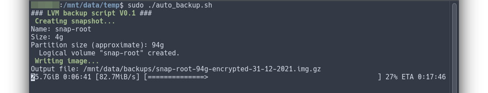

## Linux LVM backup script

### Main goals of this script:
* Provides better alternative than using disk cloning tools (e.g. Clonezilla) as a bitwise backup strategy
* Creates full image of a disk partition using LVM snapshot and dd
* Doesn't interfere with nor interrupt normal operation of the system and can be run in the background, thanks to the nature of LVM
* Backups are compressed with pigz, utilizing multiple CPU cores
* Backups are encrypted
* Can be scheduled to run unattended using cron etc.



### Requirements:
* Disk partitions must be provisioned using LVM
* Volume group (VG) must have enough unallocated free space for the snapshot. Script will attempt to use around 5% of the partition size. If the logical volume (LV) being backed up is 60GB in size, then 3GB of free space is needed for the snapshot. As best practice, the backups should be taken during periods of low activity on the system in order to ensure that changes made to the file system during backup process can't outgrow snapshot size and therefore render it (and the backup image) unusable.
* Required software: `pigz`, `openssl`, `pv`

### Setup:
0. Become root / su. On Ubuntu:
```
sudo -i
```
1. Ensure required software is installed. On Ubuntu:
```
apt install pigz openssl pv
```
2. Download the script to /usr/local/bin on your system:
```
curl https://raw.githubusercontent.com/sharket/linux-lvm-backups/main/auto_backup.sh -o /usr/local/bin/auto_backup.sh
```
3. Make it executable:
```
chmod +x /usr/local/bin/auto_backup.sh
```
4. Edit the script and define variables:
```
### DEFINE THESE VARIABLES:

# Text file with password used for backups (it should be owned by root and have permissions set with chmod 600):
BACKUP_SECRET=$(cat /usr/local/etc/backup_secret.txt)

# Volume group. Run "sudo lvs" to check:
VG="vgbox"

# Logical volume inside volume group you want to backup. Run "sudo lvs" to check:
LV="root"

# Output folder (include slash at the end). Ideally it should be on a separate disk and (ofc) MUST NOT be on the logical volume you want to backup:
OUTPUT_FOLDER="/mnt/data/backups/"

### END OF USER VARIABLES
```
5. Create backup secret (password used for encryption) and store it in a file. IMPORTANT: You will need that password to restore the backup!
```
echo 'YOUR_BACKUP_SECRET' > /usr/local/etc/backup_secret.txt
```
6. Make sure permissions are restricted to root only:
```
chown root:root /usr/local/etc/backup_secret.txt
chmod 600 /usr/local/etc/backup_secret.txt
```
7. Script can be run at this point or scheduled using cron.

#### About the BACKUP_SECRET (optional):
Storing passwords in clear text isn't a good practice, although for the purpose of this script and for home use, honestly, it's fine. If you want to follow best security practices and do things by the book, you could additionally encrypt it with openssl (explained below), using gpg, system keyring or vault, or any other preferred method.

1. Encrypt your BACKUP_SECRET with additional password:
```
echo 'YOUR_BACKUP_SECRET' | openssl enc -aes-256-cbc -md sha512 -a -pbkdf2 -iter 100000 -salt -pass pass:'YOUR_PASSWORD' > /usr/local/etc/backup_secret.txt
```
2. Then replace BACKUP_SECRET variable in the script with:
```
BACKUP_SECRET=$(cat /usr/local/etc/backup_secret.txt | openssl enc -aes-256-cbc -md sha512 -a -d -pbkdf2 -iter 100000 -salt -pass pass:'YOUR_PASSWORD')
```
Additionally, instead of using root account, you can create a dedicated one for running the script with explicit ownership and permissions for the password file. This would also require setting up appropriate permissions for that account to manage LVM snapshots, imaging with dd, and write access to the output folder.

### How to restore?
You can list available Logical Volumes with `sudo lvdisplay` command. Let's assume your target partition is /dev/vg_test/temp. Volume Group in this case is named `vg_test`, Logical Volume is `temp`. To restore the image:

0. Become root / su first. On Ubuntu:
```
sudo -i
```
1. Run this to restore:
```
cat 'PATH_TO_YOUR_IMAGE' | openssl enc -aes-256-cbc -md sha512 -d -pbkdf2 -iter 1000 -salt -pass pass:'YOUR_BACKUP_SECRET' | gzip -dk | dd of=/dev/vg_test/temp bs=50M
```
This will wipe all the existing data on that partition! Target partition must be the same size or bigger than the source one.

### More info and sources:

Encryption method explained: https://www.howtogeek.com/734838/how-to-use-encrypted-passwords-in-bash-scripts/


